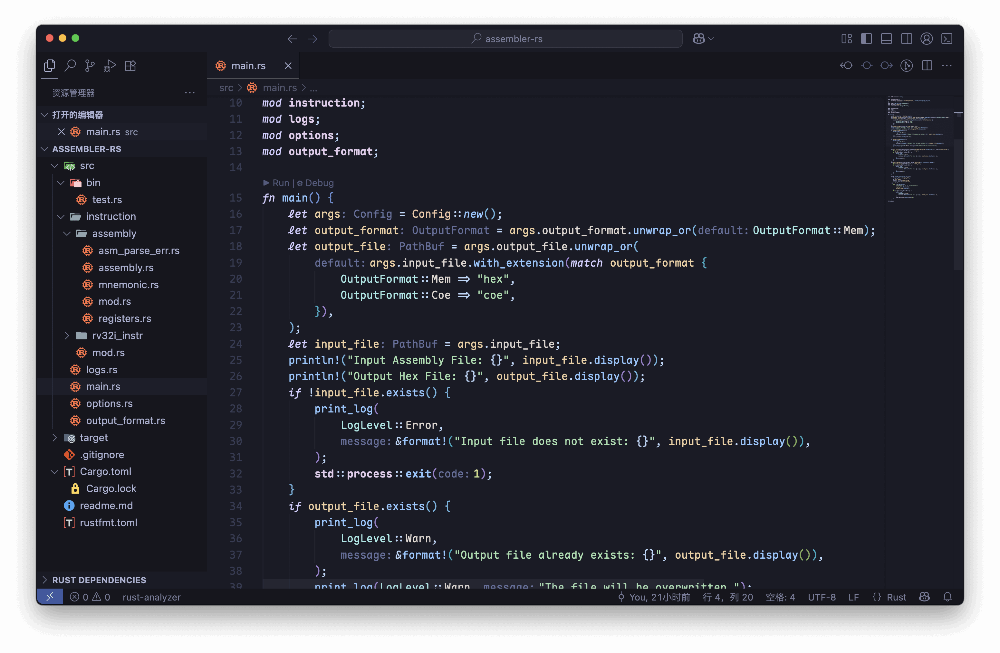
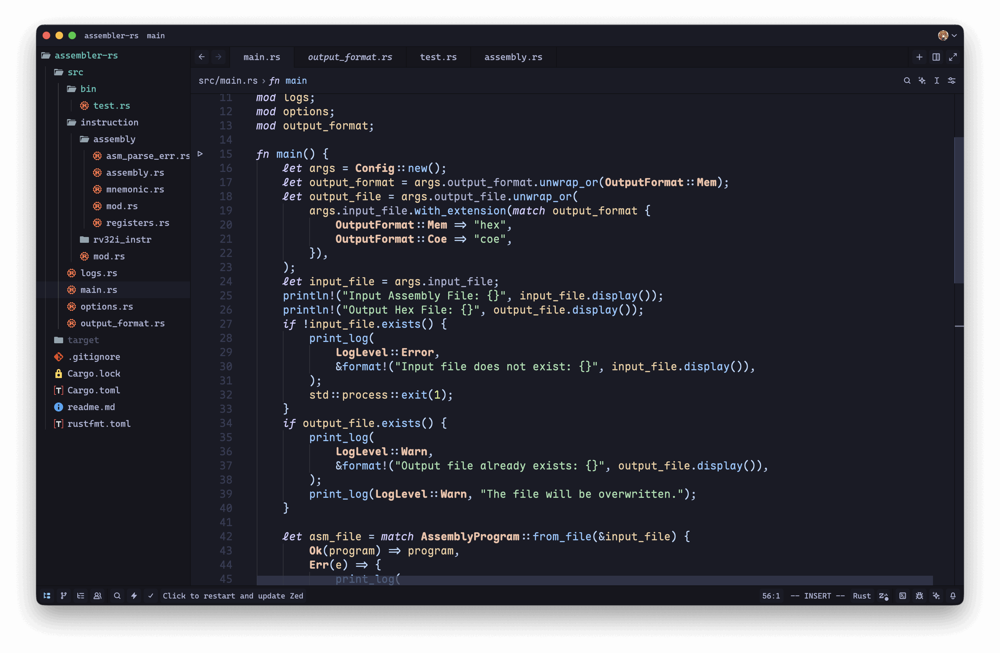
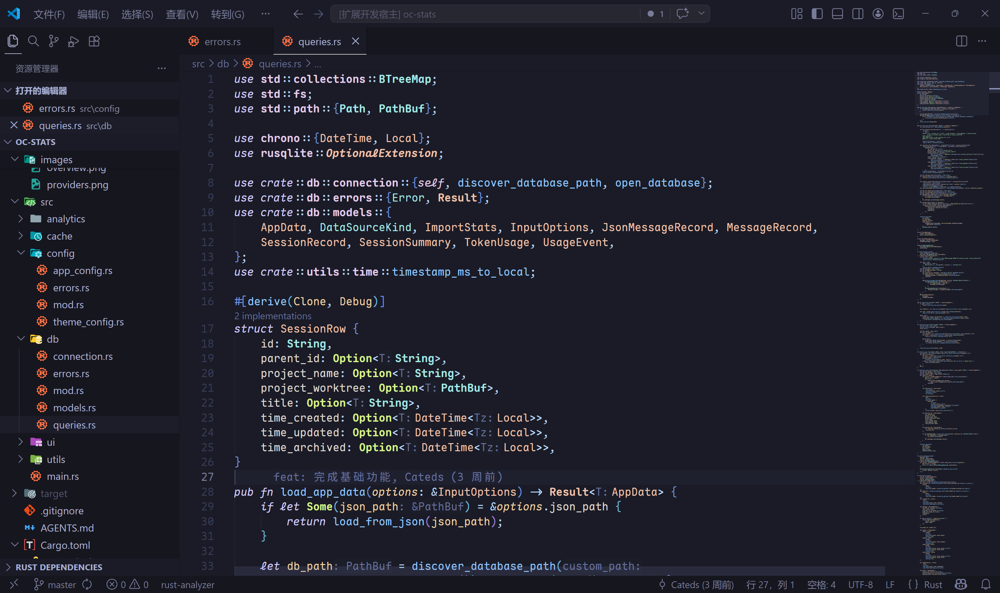
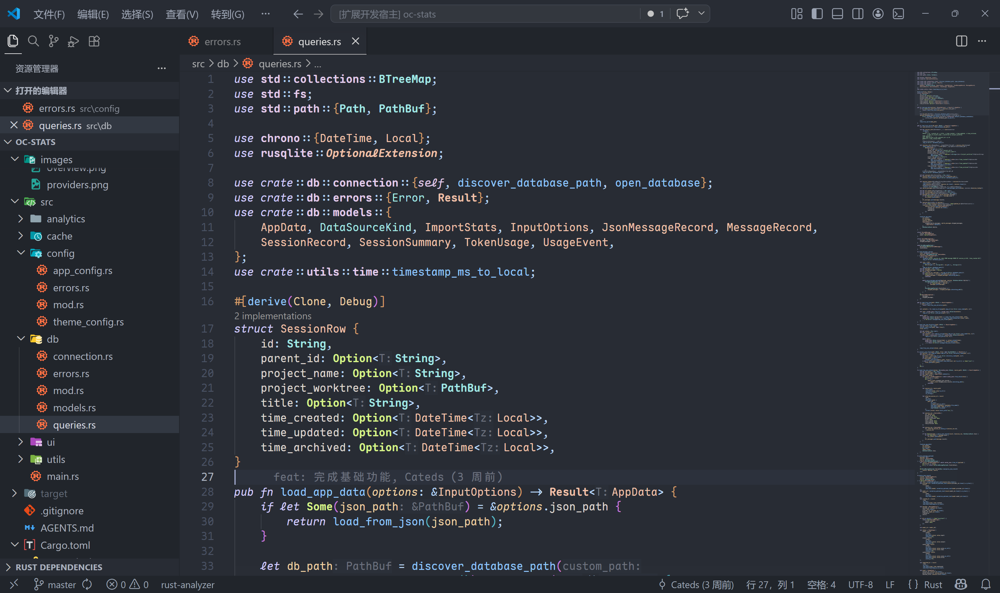
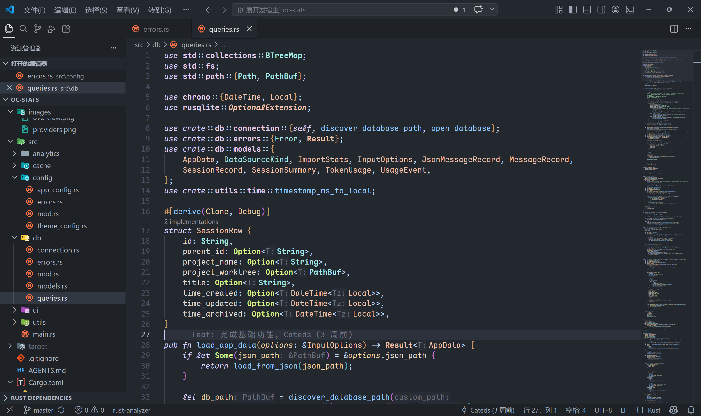
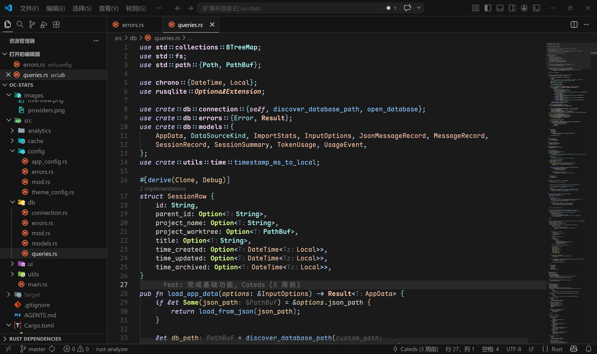
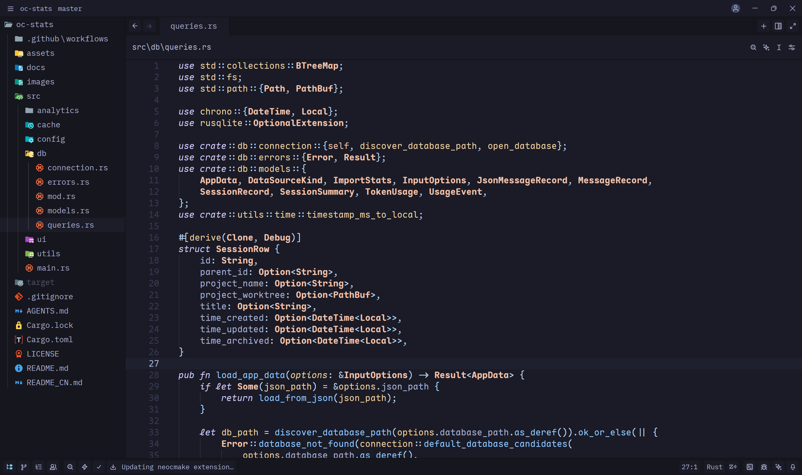
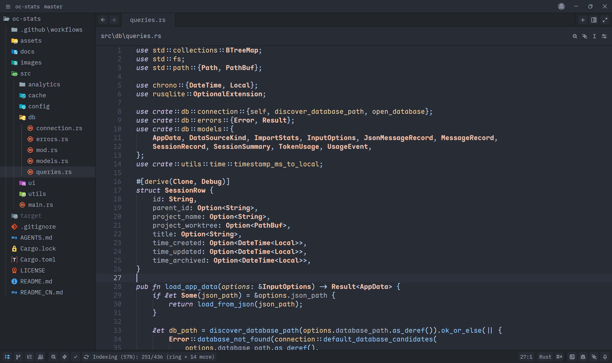

# Maple Fusion Themes

A collection of refined dark themes for VSCode and Zed, combining popular color schemes with Maple-style syntax highlighting and enhanced readability.

|                                   |                             |
| --------------------------------- | --------------------------- |
|  |  |

## **Preview**

### On VSCode

| Tokyo Maple                              | One Dark Maple                                 | One Dark Maple Darker                                        | Cursor Dark Maple                                    |
| ---------------------------------------- | ---------------------------------------------- | ------------------------------------------------------------ | ---------------------------------------------------- |
|  |  |  |  |

### On Zed

| Tokyo Maple                                      | One Dark Maple                                         |
| ------------------------------------------------ | ------------------------------------------------------ |
|  |  |

## **Included Themes**

| Theme                     | Base         | Description                                                                |
| ------------------------- | ------------ | -------------------------------------------------------------------------- |
| **Tokyo Maple**           | Tokyo Night  | Original theme with warm, comfortable colors and Maple syntax highlighting |
| **One Dark Maple**        | One Dark Pro | Classic One Dark aesthetic with Maple-style enhancements                   |
| **One Dark Maple Darker** | One Dark Pro | Darker variant of One Dark Maple for reduced eye strain                    |
| **Cursor Dark Maple**     | Cursor Dark  | Cursor IDE's signature dark theme with Maple refinements                   |

## **Features**

### UI Enhancements (All Themes)

- Enhanced text contrast in multiple areas, such as Sidebar and Activity Bar foreground colors
- Changed the originally bluish git unstaged indicator color to a more greenish hue
- Brightened the foreground colors of Inlay Hint, Code Lens, and Breadcrumb
- Fine-tuned terminal colors
- Removed most dark borders, using color contrast to emphasize boundaries
- Changed the color scheme of title bar, tabs, terminal, and Activity Bar to match the editor's light colors
- Added color-changing effect to Status Bar during debugging
- Added transparency to drag effects

### Syntax Highlighting (Maple Style)

- Fine-tuned syntax highlighting based on **Maple Theme**
- Removed underline effects for parameters in Maple Theme
- Added underline styles to mutable variables, functions, methods, and mutable Self parameters, consistent with the Default Dark Modern theme

## **Credit**

- [One Dark Pro](https://github.com/Binaryify/OneDark-Pro): Base theme for One Dark Maple variants
- [Tokyo Night (VSCode)](https://github.com/tokyo-night/tokyo-night-vscode-theme): Base theme for Tokyo Maple
- [Tokyo Night (Zed)](https://github.com/ssaunderss/zed-tokyo-night): Reference for Zed color scheme
- [Cursor Dark (VSCode)](https://github.com/CedricVerlinden/cursor-dark): Base theme for Cursor Dark Maple
- [Maple Theme (VSCode)](https://github.com/subframe7536/vscode-theme-maple/): Syntax highlighting style reference
- [Maple Theme (Zed)](https://github.com/ssaunderss/zed-maple-theme): Zed syntax highlighting reference

## **License**

MIT
