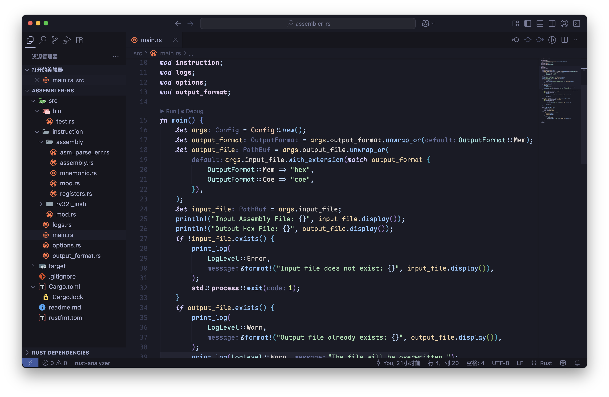
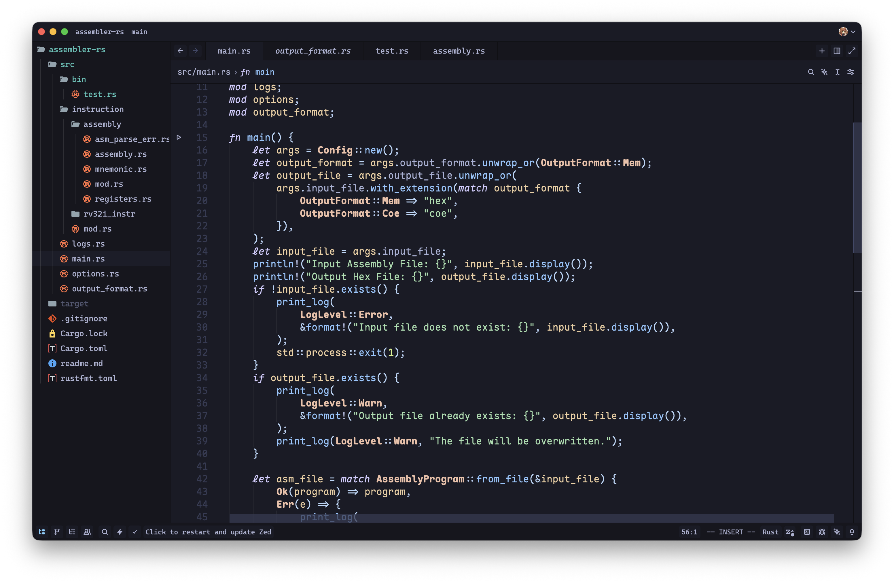

# Tokyo Maple Theme

A dark theme for VSCode and Zed, modified based on the Tokyo Night theme, combining Maple's color style with One Dark Pro's coloring ideas.

## **Features**

- Editor color scheme based on the **Tokyo Night** theme
  - Enhanced text contrast in multiple areas, such as Sidebar and Activity Bar foreground colors
  - Changed the originally bluish git unstaged indicator color to a more greenish hue
  - Brightened the foreground colors of Inlay Hint, Code Lens, and Breadcrumb
  - Fine-tuned terminal colors
- Adjusted border and background colors of page elements based on **One Dark Pro** coloring concepts
  - Removed most dark borders, using color contrast to emphasize boundaries
  - Changed the color scheme of title bar, tabs, terminal, and Activity Bar to match the editor's light colors
  - Added color-changing effect to Status Bar during debugging
  - Added transparency to Tokyo Night theme's drag effects
- Fine-tuned syntax highlighting based on **Maple Theme**
  - Removed underline effects for parameters in Maple Theme
  - Added underline styles to mutable variables, functions, methods, and mutable Self parameters, consistent with the Default Dark Modern theme
- Designed a logo in a similar style by integrating the logos of Tokyo Night and Maple Theme

## **Credit**

- [One Dark Pro](https://github.com/Binaryify/OneDark-Pro): Reference for interface coloring style
- [Tokyo Night (VSCode)](https://github.com/tokyo-night/tokyo-night-vscode-theme): Reference for VSCode color scheme
- [Tokyo Night (Zed)](https://github.com/ssaunderss/zed-tokyo-night): Reference for Zed color scheme
- [Maple Theme (VSCode)](https://github.com/subframe7536/vscode-theme-maple/): Reference for syntax highlighting color scheme
- [Maple Theme (Zed)](https://github.com/ssaunderss/zed-maple-theme): Provided a good starting point for syntax highlighting

## **License**

MIT
